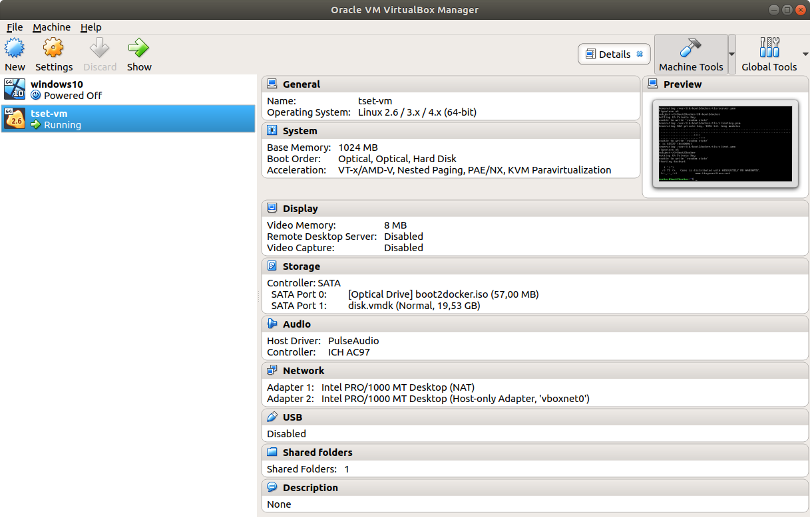

# Section 2

1. `docker image pull python` : pulls the latest version of python

2. `docker container create --tty --interactive python`
	* `--tty`  basically makes the container start look like a terminal connection session. Use with `--interactive` flag.
	* `--interactive` interact with the container.
	* The first two options are used together like `-it` (their short hand versions)

3. `docker ps -a` or `docker container ps -a` or the **newest** `docker container ls -a` are the same.

4. The command executed in 3. shows all containers (without -a flag only active are shown). `STATUS` col. can have following values:
    * created
    * running or up
    * paused
    * exited
    * restarting
    * removing
    * dead

5. Docker names can be changed with `docker container rename <OLD_AUTO_NAME> <NEW_NAME>`

6. The command `docker container start [-i] <CONTAINER_NAME_OR_ID>` has an `-i` flag but no `-t` flag.
The reason behind this is that once the container has been created, `start` command only starts it.
The `--tty` and `--interactive` options must be first defined at the creation time (tty literally stands for **teletypewriter** 
which was a name of device allowing you to type text and send it away in the same time).

    Explanation:

    >Docker `start` command will start any stopped container. 
    If you used docker `create` command to create a container, you can start it with the `start` command. 
    Docker `run` command is a combination of `create` and `start` as it creates a new container and starts it immediately.

7. Here are some docker command abbreviations:
    * `docker pull` == `docker image pull` 
    * `docker create` == `docker container create`
    * `docker start` == `docker container start`
    * `docker ps` == `docker container ps`
    * `docker rm` == `docker container rm`
    * `docker run` == `docker create; docker start` (two commands in one. see the last point #6)
    * `docker rmi` == `docker image rm`

8. So when doing development with docker, there are 3 options to transfer code to the Python container:
    * `git push` (to github) + `git clone` the repo inside the container. 
	   Reasonable solution for remote container (in cloud for example)
    * `docker cp` to copy files from host to inside the container (the command can do the other way around too).
    * mount the host folder using **docker volumes**. This variant (of mounting host folder) is called the 
    **bind mount** method.

9. `docker run -v <HOST_FOLDER_PATH>:<CONTAINER_FOLDER_PATH>`
    * `-v` or `--volume` mounts the host system's folder to the container
    * paths should be absolute not relative

    ######Examples:
    `docker run -it -v ${PWD}:/app python`
    `docker run -d -v ${PWD}:/data python`  (`-d` is for detach or daemon i.e. runs it in the background freeing 
    the current session)

10. It so happens that containers started above for example, start in the python interactive shell. If the shell is exited,
the container exits (i.e. stops). According to the official documentation, this is because **an exited container is 
a normal state for a container, when the main process running in it has exited.**

11. This means that scripts can be executed inside a container as follows at the end of which the container will exit:

    `docker run -it --name baby_python -v ${PWD}:/app python python /app/myfirst.py`  (executes the myfirst.py)
    `docker start -i baby_python` (executing cmd above already saves the starting cmd i.e. `python /app/myfirst.py` into
     the container metadata so it is not needed next time.)

    ######MINOR DETAIL THAT SEEMED IMPORTANT:
    `docker run` by default attaches stdout and stderr so even skipping this flag `-it` shows the print out of python script.
    `docker start` by default attaches nothing so `-i` or `-a` flags are needed where they stand for interactive and attach resp.

12. A container image basically consists of 2 things:
    * filesystem - initialize content on the container's root disk
    * metadata - what and how to run when container starts

13. The start program definition (i.e. command that executes when the container is started) is divided into 2 parts:
    * Entrypoint - command that is **not ignored** when a container is starts with command line parameters
    * Command - command that wil be ignored if custom command line parameters are passed when starting a container
    * While entrypoint is not ignored, it can also be overridden *explicitly* using the `--entrypoint` flag (also 
    at creation time)

    For example, consider the following settings for some image:
    `ENTRYPOINT ["echo", "one"]`
    `CMD ["two", "three"]`

    If the container above is run (these are creation time things so I mean `run` **not** `start`), it executes the command
    `echo one two three`. However, if the container above is run with custom parameters like:

    `docker run -it <SOME_IMAGE_NAME> five six`

    this will execute:
    `echo one five six`

    So the `CMD` part of the parameters get overwritten.

14. `docker inspect` has a flag `--format` that can be used to see the JSON in a focused way. Here are the outputs for some images:

    * `docker inspect --format "ENTRYPOINT={{.Config.Entrypoint}} CMD={{.Config.Cmd}}" pythonincontainers/entrypoint:latest`
    
        outputs
    
        `ENTRYPOINT=[echo one] CMD=[two three]`

    * `docker inspect --format "ENTRYPOINT={{.Config.Entrypoint}} CMD={{.Config.Cmd}}" python`

        outputs
    
        `ENTRYPOINT=[] CMD=[python3]`

    * `docker inspect --format "ENTRYPOINT={{.Config.Entrypoint}} CMD={{.Config.Cmd}}" hello-world:latest`

        outputs
    
        `ENTRYPOINT=[] CMD=[/hello]`

15. `docker logs <CONTAINER_NAME>` returns logs of stdout and stderr for a container (useful esp. those
running in detached mode i.e. in background). Here are some other options:
    * `--since <TIME>` self explanatory. Time can be entered like `5m` for 5 minutes.
    * `-t` or `--timestamp` adds a timestamp
    * `--tail 3` shows the last 3 log lines
    * `-f` or `--follow` follows the log

16. `docker attach <CONTAINER_NAME>` is a small helper command that attaches the stdin, stdout and stderr to the terminal.
    * One thing is that once you're attached, doing `Ctrl+c` will close the main process, hence the app and kill the container
    * So the right way to detach is `Ctrl+p` followed by `Ctrl+q`

17. Docker by default creates the container with `--sig-proxy true` means certain control characters (like `Ctrl+c`) are
interpreted as signals. **`Ctrl+c` generates SIGINT which is interpreted by many apps a request to quit.**

18. Docker has a really cool feature of running an ad-hoc command inside a **running** container called `exec`. 
    For example, `docker exec <CONTAINER_NAME> ps -ef` returns all the processes inside the container. Another example,
    `docker exec -it <CONTAINER_NAME> bash` runs a bash terminal within the container.

19. Docker container can use up all of the system resources (CPU and RAM). For windows and mac os, the resources are limited
by the linux VM resources running on them however for Linux it really can take over the full system's resources. Hence,
to prevent that, the docker container can be run with parameters that limit the resources it is allowed to use. Examples:

    `docker run --memory 200m ...`  200mb of RAM
    
    `docker run -m 200m ...` 	200mb of RAM (basically showing the shorthand)
    
    `docker run -m 200m --memory-swap 300m` 200mb of RAM and 100mb of swap (offloading RAM to disk to free up RAM and 
    re-reading it later) 
    
    `docker run -m 200m --memory-swap 200m` 200mb of RAM and **0mb** of swap (memory-swap is the total value of swap 
    and memory so if it is the same, then no memory left for swap)

    **Note:** Not setting the `--memory-swap` flag means the swap memory is 2x memory. Explicitly setting it to `-1` 
    means unlimited swap memory.

20. `docker stats` shows you the resource usage statistics of running containers.

## Networking

1. Each container gets its own network stack. Under the **default** setting, all containers are connected to the same Virtual Network
Bridge and can communicate with each other using their internal IP addresses (but not their names i.e. no DNS resolution)

2. Docker allows the creation of **Virtual Network** and containers can be attached to it. Docker allows DNS name resolution
based on the container name (i.e. names act like URLs) for such user-defined networks. It can be created as follows:

    `docker network create my-net`

    The container attachment looks like this:

    `docker run -d --network my-net <IMAGE_NAME>`  no `-p` flag since we're not interested in accessing this container 
    directly from host but perhaps through another container.

    The DNS is dynamic i.e. containers created after a particular container also become visible/accessible to older ones too.

3. Other than make all containers join a network, another way of making the communicate with each other is called **Container
Linking**.

    `docker run --rm -it --link simple-flask:webserver <IMAGE_NAME>` 

    This adds `simple-flask` (i.e. the name) as well as its alias `webserver` is added to the `/etc/hosts` along with the 
    internal IP address automatically.

    This option `--link` is nearly identical to the option `--add-host` that looks like this:

    `docker run -it --add-host simple-flask:172.17.0.2 <IMAGE_NAME>`

    In this case also the value is added to the `/etc/hosts/` but the internal IP address must be found out first.

    ######KEY DIFFERENCE BETWEEN `--add-host` `--link`: 
    linking carries over the env. variables over to the container it is being linked to but not in case of `--add-host`.
    The env. variables all start with prefix `<ALIAS>_` (in this case `WEBSERVER_...`)

    **NOTE:** Container Linking has been marked as legacy feature so it will disappear in the future.

4. **Docker environment variables** can be set with `--env` or `-e` flag like this:

    `docker run -d --name postgres --network my-net --env "POSTGRES_PASSWORD=mysecret" postgres`

5. Side point: the command above starts the DB engine including the server. PgAdmin4 is an admin tool to manage such 
postgres servers by establishing connections to those servers using the server's host address, superuser name 
and password.

6. Networking is a core capability of docker containers.
    
    * Dockers are connected to the internet through the NAT (Network Address Translation).
    A NAT is used for assigning IP Addresses with a single host.
    
    This basically means that each docker container has a private IP address visible only locally.
    To the outside world, the host still has a *singular* IP address.
    
    * This means that docker containers can establish TCP connections to internet hosts.
    
    * The other way round i.e. if internet clients' want a TCP connection *to* the docker containers, this is
    directly not possible since publicly the clients see only one IP address (that of the host).
    
    * The way to address this issue (of establishing incoming connections to multiple containers running on a single 
    host), a port is exposed by the container that is then mapped on to the host's port. 
    This is called **Port Forwarding**.
    
    So any (internet) network node (client) with Host IP visibility can establish TCP connection to this mapped port
    and effectively access the docker container.
    
    * The default bridge network does not provide container name resolution (DNS resolution) i.e. no mapping
    of container names to IP Addresses. User-defined networks do.
    
7. **`docker network ls`**  - command to list all the available docker networks. Below is the one such output.
    The only one defined by the user is `my-net`. The other three are there by default. 

    | NETWORK ID   | NAME   | DRIVER | SCOPE    |
    |:-------------|:-------|:-------|:---------|
    |0e0df8d7fdba  | bridge | bridge | local    |
    |d70b60b019ab  | host   | host   | local    |
    |02b443b069d9  | my-net | bridge | local    |
    |77a99ff9e6b2  | none   | nan    | local    |
    
    * A network connected to `host` has *no network isolation*. All its published ports are directly visible in the
    host system. This is not really used in production.

8. `docker network create` allows us to create user-defined networks.

    * Docker uses the concept of **drivers** to extend its network capabilities. Several such drivers are available
    built-in, others can be install as network plug-ins.
    
    * `bridge` is the default network driver
    
    * `macvlan` creates a network where containers look like separate physical devices with their own MAC addresses.
    Supporting hardware setup is needed (so-called promiscuous mode). Not very commonly used.
    
    *`overlay` is very important. It allows for creation of network across several docker runtimes (or several hosts).
    It has the scope of a **swarm** rather than individual hosts (or to be more precise individual docker engines).
    With `docker machine` several docker runtimes can be run on a single host. These simulate a swarm on a single host
    as well and would do well with the `overlay` driver.
    
9. `docker container ps --filter network=<NETWORK_NAME>` Docker containers connected to a single network can be listed 
with this command. The command is useful if docker doesn't let you remove a network because of attached containers.

10. `docker network connect <NETWORK_NAME> <CONTAINER_NAME>` to connect a container to another network. The containers
of this network become visible to this newly joined container.

    To disconnect, `docker network disconnect <NETWORK_NAME> <CONTAINER_NAME>`
    
11. `docker network create --internal <NETWORK_NAME>` creates a network that can let containers joining it be visible
to each other but has no internet connectivity. This is useful if a potentially suspicious image is being run.

## Data Persistence

1. Containers are stateless. They are essentially ephemeral. Storing data inside its filesystem means data is gone as 
soon as the container is gone. Furthermore, even if such an ephemeral use is acceptable to you, it is better to use
the `tmpfs` mount. Quote from official docs:
    
    >If your container generates non-persistent state data, consider using a `tmpfs` mount to avoid storing the data
    anywhere permanently, and to increase the container’s performance by avoiding writing into the container’s 
    writable layer.

2. Docker makes data persistence possible with the help of Persistent Data Volumes. Docker runtimes give us the
possibility to mount volumes to containers.

3. `docker volume create my-vol` creates a new volume. It is created on the local host filesystem (or the VM if we are
using a non-linux OS.). Inspecting it with `docker volume inspect my-vol` on an ubuntu OS returns this for me:

    ```json5
    [
     {
        "CreatedAt": "2020-05-29T18:28:27+02:00",
        "Driver": "local",
        "Labels": {},
        "Mountpoint": "/var/lib/docker/volumes/my-vol/_data",
        "Name": "my-vol",
        "Options": {},
        "Scope": "local"
     }
    ]
    ```

4. Volumes can only be mounted at the time of container creation. There is no straightforward way of mounting a volume
on an already running container.

5. `docker run -it --name mypython --volume my-vol:/app <IMAGE_NAME>` will start the container with volume mounted in
the `/app` path of the container.

6. Performance of the data storage can be enhanced by mounting a SSD to this directory or even a network storage to
prevent data loss even in case of docker host failure.

7. Even a database container keeps its data in a volume since even if the database container fails, the data is not
lost.

8. Naturally, volumes can be removed as well using the following command:

    `docker volume rm <VOLUME_NAME>`

    If the volume is mounted to a container, this will fail. First the container must be removed.
    
9. Docker has a special kind of a volume mount called **bind mount** that translates to mounting a directory of the host
to the container. This is specially useful in a development environment where you want to use the IDEs etc installed
on the host, but want the code to run in a container (i.e. an isolated untouched environment that is replicable to 
production later). The general syntax is as follows:

    `docker run --volume <HOST_DIR>:<CONTAINER_DIR> ...` where both paths must be absolute.
    
    Examples:
    
    `docker run -v ${PWD}:/app <IMAGE_NAME>`

    `docker run -v ${PWD}/data:/data <IMAGE_NAME>`

10. **Bind mounts** have limited functionality since they are managed outside of docker and can't be part of the 
**Dockerfile** since this would amount to hard-coding the absolute path of the host dir in the Docker file which may 
not exist in the next system the image is run on. Hence, docker volumes are the way to go in that case.

    Direct quote of first paragraph on [bind mounts](https://docs.docker.com/storage/volumes/):
 
    >Bind mounts have been around since the early days of Docker. Bind mounts have limited functionality compared to 
    volumes. When you use a bind mount, a file or directory on the host machine is mounted into a container. The file 
    or directory is referenced by its full or relative path on the host machine. By contrast, when you use a volume, 
    a new directory is created within Docker’s storage directory on the host machine, and Docker manages that 
    directory’s contents.

    >The file or directory does not need to exist on the Docker host already. It is created on demand if it does not 
    yet exist. Bind mounts are very performant, but they rely on the host machine’s filesystem having a specific 
    directory structure available. If you are developing new Docker applications, consider using named volumes instead.
    You can’t use Docker CLI commands to directly manage bind mounts.

## Dockerfile

1. To share code that leads to perfectly reproducible outcome, we also need the right environment. 

2. This can be done with the means of a Dockerfile that can be used to create a container image using **`docker 
build ...`**. The image can then be used to start a container in which the code runs as we expect it to. This is
a best practice.

3. Images are build on top of images. Very often a `Dockerfile` begins with:
    
    `FROM python`
    
    This indicates that the image we plan to build takes `python` image as its base image. It is kind of subclassing
    from a parent class... **kind of**.
    
4. Docker creates a temporary container out of the base image. This build container is then used to execute the remaining
Dockerfile instructions shaping it as the user wishes to.

5. `WORKDIR <path>` sets the working directory of the container to `<path>`. If the directory is not available, it will
be created. That is why we often don't see a separate `RUN mkdir ...` before it.

6. `COPY . .` copies contents of current directory on our build host to *working directory* (set with `WORKDIR`)
of the container. We can use absolute or relative paths for `COPY`. The current directory of the build host is where
we start the build command from.

7. `RUN pip install -r requirements.txt` is an example of simply a bash command that can be run using well `RUN`.
Of course, the `pip` must already exist either as a part of base image or be installed through some earlier `RUN` command.
`RUN` commands get executed in the **build container also**.

8. `EXPOSE 5000` exposes the container port 5000 for mapping to the runtime host (i.e. the host running docker). A 
person running our image later can simply do:

    `docker run -P ...` to automatically map all container ports to the first available ports in the runtime host. The
    flag `-P` (capital p) ensures that. If you are curious what ports might get mapped? One way to look at it
    is to find it in the list of `docker container ps` and it should be there under the `PORTS` column.
    
9. `ENV FLASK_DEBUG=true` sets an environment variable `FLASK_DEBUG` to true. Interestingly, this environment variable
will also be set in the **build container** (i.e. the temporary container created in the build phase) too for all 
subsequent commands.

10. `CMD python flask-hello.py` defines the command that should be executed when the container is fired up. As for the
difference between `CMD` and `RUN`, this explains it well:

    >**`RUN`** and **`CMD`** are both Dockerfile instructions. `RUN` lets you execute commands inside of your Docker image. These 
    commands get executed once at build time and get written into your Docker image as a new layer. ... `CMD` lets you define 
    a default command to run when your container starts.

11. `docker build -t flask-hello:1.0 .` builds the image using the Dockerfile. `-t` flag is used to name the image
and the subsequent `:1.0` sets the version tag (try `docker image ls` for details).  The last dot simply sets the 
context directory to the current directory. This is where the Dockerfile is expected to be and also the contents of 
which will be copied in to the container image.

## Dockerhub

1. `shabie/flask-hello:latest` has 3 parts:
    * `shabie` is the hub account name (can be a person or org. like in github)
    * `simple-flask` is the actual repository name
    * `latest` or something else specifies the tag of this particular image
    
2. One repository can hold any number of images each with one or more tags. Normally, tag is used for image versioning.

3. Multiple tags allow the same image to be referenced with each of them.

4. To push to docker hub, the docker runtime must know our login credentials too. One way to login through the CLI
is as follows:
    
    `docker login` --> requests a username and password to let you login. By default, username password are stored in:
    `/home/shabie/.docker/config.json`
    
5. `docker login -u <USERNAME> -p <PASSWORD>` for a one-liner.

6. `docker logout` logs you out.

7. `docker tag shabie/flask-hello:latest shabie/flask-hello:1.0` tags the repo additionally with `1.0`
    
    The `docker image ls` now shows the entry for `shabie/flask-hello` **twice** each with one tag only.
    
    | REPOSITORY         | TAG          |   IMAGE ID   |     CREATED    | SIZE   |
    |:-------------------|:-------------|:-------------|:---------------|:-------|
    | shabie/flask-hello | 1.0          | 207e5ba51cae | 6  minutes ago | 944MB  |
    | shabie/flask-hello | latest       | 207e5ba51cae | 6  minutes ago | 944MB  |

8.  `docker push shabie/flask-hello` pushes the image to the docker hub. Takes a while. Repository should be visible now
in the docker hub.

9. If another version `2.0` is push (also tagged `latest`), then the repository shows in total 3 tags:
    * latest
    * 2.0
    * 1.0
    
    No easy way to know if they all refer to the same or different versions. Better to include in the description and
    follow conventions like `latest` is just an alias tag (or like a symlink) to the latest repository.
    
10. Dockerhub is a great source for official docker images.

11. `docker run -it python` docker automatically **assumes** that the Python base image tag requested is the `latest` 
one.

12. Tags often have a `rc` flag in their name which stands for release candidate (a name for beta versions).

13. Just like github, an updated version of the image can be pulled using the following command:

    `docker pull python:latest`
    
14. Dockerhub has also `slim` tag which means the image is smaller in size and also `alpine` which is even smaller.

    The downside is that if you don't know what is missing in these lean versions, writing a Dockerfile is difficult
    because you are not sure how to mould the image to your needs given that many common functionalities are missing.
    So the safer option may be to go with the bigger official image.
    
15. A general strategy is to start development with full base images (of python let's say) and then do the image
tuning to reduce it in size later.

## Portainer (Docker GUI)

1. There is a very simple tool called Kitematic that only runs on mac.

2. There is a much more rich tool called **Portainer** that runs itself as a container.

3. Here's how to start it:

    1. `docker volume create portainer_data` create a volume for the tool
    2. `docker run -d -p 8000:8000 -p 9000:9000  -v /var/run/docker.sock:/var/run/docker.sock -v portainer_data:/data 
    portainer/portainer`
        1. Two ports are exposed 8000 and 9000
        2. Two volumes are mapped, one is a bind-mount the other is a docker volume
        3. The bind-mount is basically a linux socket used by docker client to communicate with docker engine

4. The tool can then be accessed from `localhost:9000`

5. One of the best options to understand the fine-grain controls of docker container, go to "Create container" and
check out the different setting tabs like "Command & logging", "Volumes", "Capabilities" etc...

6. Another **really** cool option is to create an image out of any container. Consider this to be a kind of a container 
backup with all its filesystem settings and options being frozen into a (snapshot) image.

## Docker Machine [VirtualBox]

**Docker Machine is a tool used to create and manage Docker Runtime environments (plural is key) encapsulated as
virtual machines.**

1. Such VMs can be created locally (on the host) or remotely in the cloud.

2. So why docker machines when theoretically you could:
    1. provision a VM with linux
    2. install docker
    3. enjoy full functionality?
    
    While Docker Machine does exactly this, it comes with a set of convenience commands that hide away the complexity
    of architecture and a remote docker machine feels exactly like a docker engine running locally even when in cloud.
    
3. Docker has a so-called driver model so the same tool can provision and manage environment in a number of host types
and technologies.

4. Docker Machine can work with a number of local VMs (like VirtualBox, Hyper-V etc.) and a number of cloud providers
like DigitalOcean, Azure, AWS, GCP etc.

5. Docker Machine even has a generic driver to install docker on a remote machine accessible via SSH. I just wrote this
point but I am not sure how to use it.

6. Let's create a VM using docker machine (it is created with VirtualBox in the background due to the way its setup):

    * `docker-machine create test-vm`
    
    This outputs the following:
    
    ```
    Creating CA: /home/shabie/.docker/machine/certs/ca.pem
    Creating client certificate: /home/shabie/.docker/machine/certs/cert.pem
    Running pre-create checks...
    (test-vm) Image cache directory does not exist, creating it at /home/shabie/.docker/machine/cache...
    (test-vm) No default Boot2Docker ISO found locally, downloading the latest release...
    (test-vm) Latest release for github.com/boot2docker/boot2docker is v19.03.5
    (test-vm) Downloading /home/shabie/.docker/machine/cache/boot2docker.iso from https://github.com/boot2docker/boot2docker/releases/download/v19.03.5/boot2docker.iso...
    (test-vm) 0%....10%....20%....30%....40%....50%....60%....70%....80%....90%....100%
    Creating machine...
    (test-vm) Copying /home/shabie/.docker/machine/cache/boot2docker.iso to /home/shabie/.docker/machine/machines/test-vm/boot2docker.iso...
    (test-vm) Creating VirtualBox VM...
    (test-vm) Creating SSH key...
    (test-vm) Starting the VM...
    (test-vm) Check network to re-create if needed...
    (test-vm) Found a new host-only adapter: "vboxnet0"
    (test-vm) Waiting for an IP...
    Waiting for machine to be running, this may take a few minutes...
    Detecting operating system of created instance...
    Waiting for SSH to be available...
    Detecting the provisioner...
    Provisioning with boot2docker...
    Copying certs to the local machine directory...
    Copying certs to the remote machine...
    Setting Docker configuration on the remote daemon...
    Checking connection to Docker...
    Docker is up and running!
    To see how to connect your Docker Client to the Docker Engine running on this virtual machine, run: docker-machine env test-vm
    ```
    
    * `docker-machine env test-vm` connects the docker client to the new VM
    
    The execution of the command above returns the following:
    ```
    export DOCKER_TLS_VERIFY="1"
    export DOCKER_HOST="tcp://192.168.99.100:2376"
    export DOCKER_CERT_PATH="/home/shabie/.docker/machine/machines/test-vm"
    export DOCKER_MACHINE_NAME="test-vm"
    # Run this command to configure your shell: 
    # eval $(docker-machine env test-vm)
    ```
   
   This sets 4 environment variables:
   1. Sets TLS to true meaning docker client should use TLS to communicate with the new engine. TLS is a 
   secure communication protocol.
   2. Sets the IP address and port number for docker engine **in the machine**.
   3. Sets the directory where keys and secrets are held used to communicate with the newly minted docker
   engine.
   4. Sets the name of the new machine.
   
   Last two lines simply show how to set a *local* shell with these 4 environment variables and here comes the
   interesting bit:
   
   Once the environment variables have been set in the shell, **any subsequent Docker command use is going
   to assume Docker Runtime in our freshly provisioned machine!** The env. variables remain set until we overwrite them
   or explicitly unset them.
   
    `docker image ls` is a good proof to show that this new environment shows no images at all.
    
7. Interestingly, docker client simply uses the environment variables. It has no idea if the docker server is
up and running. 

    Let's remove the VM:

    `docker-machine rm -f test-vm`
    
    The environment variables are still there. Let's try again:
    
    `docker image ls`
    
    now returns:
    
   `unable to resolve docker endpoint: open /home/shabie/.docker/machine/machines/test-vm/ca.pem: no such file or 
   directory` 
   
8. To unset the now invalid variables, we do the following:

   `env | grep DOCKER` to get the list.
   
   `unset DOCKER_MACHINE_NAME DOCKER_CERT_PATH DOCKER_TLS_VERIFY DOCKER_HOST` to unset it.
   
   OR
   
   you could simply do the following docker convenience command:
   
   `eval $(docker-machine env -u)`
   
   OR
   
   Finally, closing the shell window will also unset the environment variables :)
   
9. A container can be created in the machine (VM running docker), and a local dir can be shared as bind-mount. This 
is possible since the machine uses VirtualBox Shared Folders feature to mount the dir.

    Example (assuming env. variables are set for a fired-up docker machine):
    
    WRONG `docker run -it -v ${PWD}:/app alpine`
    RIGHT `docker run -it -v /hosthome/shabie/Projects/containers/:/app alpine`
    
    because in a VM, `host` folder gets mapped to `hosthome`. I guess to avoid conflict with its own `home` folder.
    
    **mounts the local host directory to a container running inside the docker machine!**
    
10. Fun fact: The new VM created with docker-machine can be seen in the VirtualBox Manager. By default it is created
in a headless mode i.e. with its own interface (console and GUI).
    
    The key settings of the VM can be viewed in the VirtualBox Manager:
    
    
    
11. Don't forget to manage docker machines with `docker-machine` command only since docker maintains internally a
state of each VM.

12. Summary of core `docker-machine` commands:

    1. `docker-machine create`: creates and provisions a new machine (VM) with docker
    2. `docker-machine stop`: stops the machine. Performs graceful shutdown
    3. `docker-machine kill`: stops the machine. No graceful shutdown (like pulling power cable)
    4. `docker-machine start`: starts a stopped machine
    5. `docker-machine restart`: equiv. to stop and start. Can lead to new IP so old env. variables must be set again
    6. `docker-machine rm`: removes the machine (both running and stopped with -f flag). -f removes machine config files too.
    7. `docker-machine status`: shows the current status of the machine
    8. `docker-machine inspect`: provides a detailed JSON on machine config
    9. `docker-machine active`: shows the currently active machine name
    10. `docker-machine env`: shows the currently set env. variables for the "default" machine of the terminal

13. Several machines can be run in parallel each in a separate terminal session (so env. vars can be set)

14. Another way to access the machine by using SSH:

    `docker-machine ssh test-vm`
    
15. Even in one terminal, other machines can be accessed. For example, we can used this to see the
settings for another machine:

    `docker-machine config second-vm`
    
    This returns:
    
    ```
    --tlsverify
    --tlscacert="/home/shabie/.docker/machine/machines/second-vm/ca.pem"
    --tlscert="/home/shabie/.docker/machine/machines/second-vm/cert.pem"
    --tlskey="/home/shabie/.docker/machine/machines/second-vm/key.pem"
    -H=tcp://192.168.99.102:2376
    ```
    
    so these can used as follows. First save it in a variable:
    
    `SECONDVM=$(docker-machine config second-vm)`
    
    and then lets do a listing of the docker images in this second machine:
    
    `docker $SECONDVM image ls`
    
16. How does a docker machine create a runtime environment in the VirtualBox scenario:

    * VM is created with an empty Virtual Hard Disk and "boot2docker.iso" CD-ROM image "inserted" in
    the optical drive
    * VM boots from this ISO image
    * Bootprogram creates a "tmpfs" **(a RAM Disk)** (I guess it means temporary filesystem) and copies
    file from ISO into the RAM Disk
    * RAM Disk (tmpfs) is then mounted to the root directory of the machine. This means all binaries
    and config files of machine are in a RAM
    * The last point means that the changes made through a SSH tunnel in the machine only take place
    in the RAM
    * VM's Virtual Hard Disk (a persistent file on the host system) is used to store only selected 
    subdirs:
        * /tmp
        * /var/lib/docker
        * Other than that the local image cache, container volumes etc. (docker engine relevant data)
    * RAM Disk and its data exists only until VM stops or restarts
    * So a simple restart fixes all OS level changes and preserves all images, containers and volumes (held
    in persistent storage)
    
17. A machine upgrade replace "boot2docker.iso" with the latest version from the registry. So the root
file system is refreshed (newer) but keeps the same persistent storage hence preserving docker images,
containers and volumes.

18. Let's do an upgrade:

    1. Good practice to list all VMs:
    
    `docker-machine ls`
    
    2. The command for upgrade:
    
    `docker-machine upgrade test-vm`
    
    results in this output:
    
    ```
    Waiting for SSH to be available...
    Detecting the provisioner...
    Upgrading docker...
    Stopping machine to do the upgrade...
    Upgrading machine "test-vm"...
    Copying /home/shabie/.docker/machine/cache/boot2docker.iso to /home/shabie/.docker/machine/machines/test-vm/boot2docker.iso...
    Starting machine back up...
    (test-vm) Check network to re-create if needed...
    (test-vm) Waiting for an IP...
    Restarting docker...
    ```
    
    Since the machines restarted we can check if the IPs remained the same else we do the env. var. setup again:
    
    `docker-machine ls`
    
19. A couple of useful commands:

    *`docker-machine regenerate-certs test-vm` to regenerate all the certificates in case they expire
    
    *`docker-machine provision` regenerates certs plus recreate default docker runtime config. This option
    is more useful if the docker engine on the machine is broken but you don't wanna just remove the whole
    machine as it also deletes the persistent data.
    
20. machines can be made bigger in size i.e. more hardware resources incl cpu-count, memory, disk size etc

21. Containers (running in the machine) must have their exposed ports mapped to the machine ports. So
it is important to remember we map to machine IP not localhost.

    To find out the IP of the machine, we can do the following:
    
    `docker-machine ip test-vm`
    
    may return something like `192.168.99.101`
    
    So if we were to run a container like this in a terminal setup for a docker machine:
    
    `docker run -it -p 5000:5000 shabie/flask_hello:1.0`
    
    I can visit the website running in the container inside the machine on my local (host) system using:
    
    `192.168.99.101:5000`
