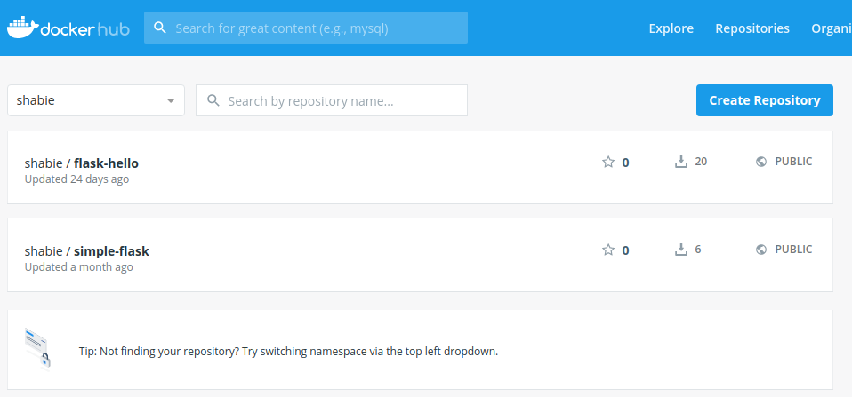
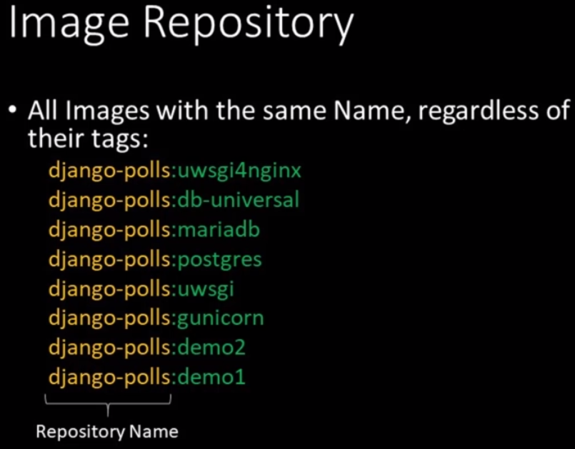
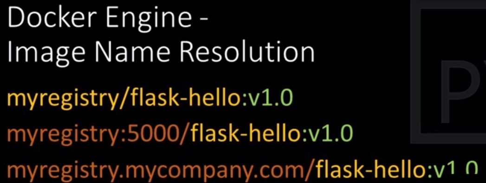
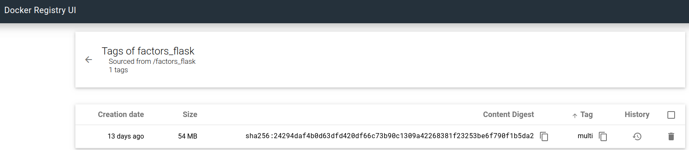
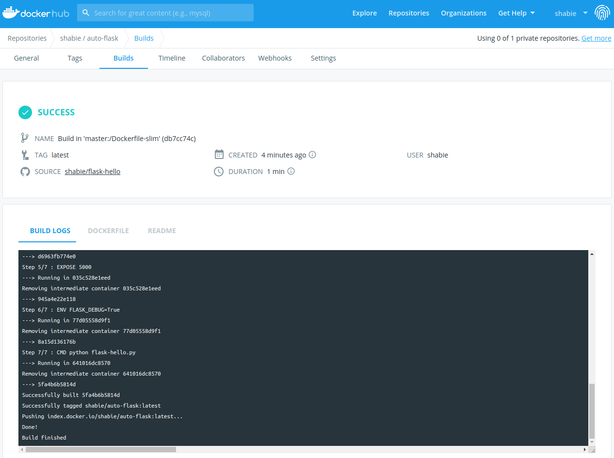
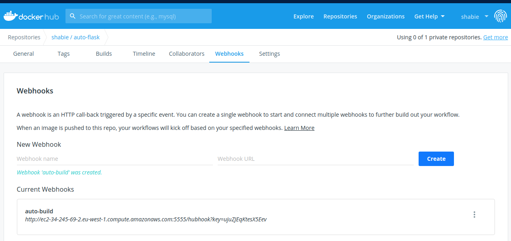

# Section 4

1. How to ship python app image?

    a. Export container into TAR archive using `docker export`. Send it over. Import the container using
       `docker import` with some other parameters needed to import the image into the docker engine cache.
       
    b. `docker save` to save a repositories with multiple tags and images. `docker load` loads all the images. This is
       potentially one way of shipping full set of images in a multi-container application.
    
    c. Use image registries like **`Dockerhub`** or from other cloud providers. `docker push` and `docker pull` are
       two commands associated with this variant.
    
    d. We can also run a local(alized) image registry i.e. on a company level, department level etc.
    
2. Here's an example of how `docker save` can be used:

    ```shell
    shabie:~flask-hello(master)$ docker image ls postgres
    REPOSITORY          TAG                 IMAGE ID            CREATED             SIZE
    postgres            latest              b97bae343e06        13 days ago         313MB
    shabie:~flask-hello(master)$ docker image ls django-polls:uwsgi4nginx 
    REPOSITORY          TAG                 IMAGE ID            CREATED             SIZE
    django-polls        uwsgi4nginx         213f3da1a717        2 days ago          985MB
    shabie:~flask-hello(master)$ docker image ls mynginx
    REPOSITORY          TAG                 IMAGE ID            CREATED             SIZE
    mynginx             lb                  99d7e3d34d23        2 days ago          111MB
    mynginx             ssl                 e294d10b30f5        2 days ago          111MB
    mynginx             latest              b614f3aa8792        2 days ago          111MB
    shabie:~flask-hello(master)$ docker save -o images.tar postgres django-polls:uwsgi4nginx mynginx
    shabie:~flask-hello(master)$ ls -lrth
    total 1,4G
    -rw------- 1 shabie shabie 1,4G Jun 22 21:40 images.tar
    ```
   
   The generated file can now be read in another docker runtime using `docker load -i /tmp/images.tar`
   
3. There are three ways images can be addressed:

    1. Official images with the short names (tag `latest` is assumed): `python`, `ngninx`, `postgres` etc.
    2. Official images with short names + tags: `python:3.7.3-slim`, `python:2.7.16-alpine3.9` etc.
    3. Any Dockerhub image with full name and tags: `shabie/flask-hello:1.0`
    
    
    
    Full name contains the prefix of the account it was uploaded from `shabie/` for example.
    
4. **All names with the same name but different tags forms a repository**.

    
    
    The tags are somewhat analogous to branches in git.
 
5. Main purpose of an image registry like Dockerhub is to share image among users, systems.

    Registries can store public and private repos. We can even run a local registry.
    
6. How to use images from registries other than Dockerhub?

    The easiest way is to use full image name **including registry address**.
    
    It has the basic following form: **`<registry>/<repository>:<tag>`**
    
    Example:
    ```
    docker.io/pythonincontainers/simple-flask:v1.1
    registry.mycompany.com/project-zeta/serviceA:0.9.1
    localhost:5001/django-polls:nginx-lb
    ```
   
    Since docker.io is the official image registry, it can be skipped. On the other hand, some registries allow
    more complex names.
    
    To pull and run a image from google for example, this command can directly be used:
    
    `docker run --rm -it gcr.io/google-containers/python:3.5.1-slim`
    
    The downloaded image looks like this in the list of images from `docker image ls`:
    
    ```
    REPOSITORY                        TAG                 IMAGE ID            CREATED             SIZE
    gcr.io/google-containers/python   3.5.1-slim          78a6e09881be        4 years ago         219MB
    ```

7. `docker image ls --digests` to see the full `DIGEST` i.e. the sha256 digest.

8. The image name resolution relies on the fact that if there is a slash in the name then it must be from some non
standard repository. If the part before the slash also contains a dot `.` then it means that it also points to an
image registry that is **not** docker.io. Exampl:

    
   
   
   The docker looks for **@** character to find a digest i.e. the EXACTLY same image. Not just the repo name and
   tag must be the same (because the image may be updated by the maintainer to fix security bugs) but the very same
   version with all its bugs.
   
   `docker push` without mentioning the tags only the repository name (like `shabie/flask-hello`) will push all tags 
   automatically (not just the latest like it does for `docker pull`)
   
8.  Names of common cloud image registries:

    1. Dockerhub - hub.docker.com
    2. Quay.io
    3. GitLab Container Registry
    4. Google Container Registry
    5. Amazon Elastic Container Registry
    6. Azure Container Registry
    
    Many of them offer automated image build and even CI/CD pipeline management.
   
    Some offer scanning of images to find potential security vulnerabilities. Dockerhub's paid version
    is one such example of a service offered.

9. Advantages of local image registries:

    1. Developer pushes the image, Ops teams can make use of it (best fit for on-prem services and apps)
    2. Image registry also for the cloud can either make use of the managed registries or you can
    simply run your own "local" registry in a compute (VM) service of the cloud.
    3. Basically for any environment beyond your own laptop (even VMs in your laptop that are isolated)
    benefit from such a local registry since the image a developer makes are otherwise accessible
    only to her.
    
10. Docker local registry comes in 2 flavors:
    1. Open source docker registry
    2. Commercial docker trusted registry
    
    The registries themselves are available as a container image.
    
    There are many options that can be configured when setting up such a local registry. We will be
    focusin on two of them:
    
        1. Storage used to hold the images
        2. Pass-through cache configuration to mirror dockerhub
        
    If configured as pass-through cache, it doesn't allow pushing images straight. In other words,
    if the config file has the proxy option, it works **only** as a proxy and not as a standard local
    registry.
    
    Hence we will be launching 2 local registries at the same time.
    
    The docker registry configuration file can be handled in a similar way as the nginx config was
    handled:
    
        1. Bind-mount a local edited copy of the config file in the container `run` command
        2. Build a custom registry image which bundles the edited copy of the config file
        
    The sample config file can be downloaded from the following address:
    
    `https://github.com/docker/distribution/blob/master/cmd/registry/config-example.yml`
    
    The command to run the docker registry is as follows:
    
    `docker run -d -p 5551:5000 --restart always --name registry-local registry:2`
    
    The image `registry:2` has a mountpoint at a  directory where it stores images. So even if we don't
    mount a docker volume, docker engine is going to create and mount an anonymous volume anyway.
    
    The `--restart always` flag is a container restart policy. By default it is set to `no`. Details can be read
    [here](https://docs.docker.com/config/containers/start-containers-automatically/#use-a-restart-policy). The
    mentioned docker daemon in the article is meant as docker engine (that runs in the daemon mode).
    
    Docker registry has no admin utility by default nor an official GUI. There is a reasonable API
    but requires very long cURL invocations.
    
    The community has developed some good registry management tools. One example of it is called Docker
    Registry UI. It can be found [here](https://joxit.dev/docker-registry-ui/). It requires minor
    modifications to the docker registry config YAML file.
    
    A nice article explaining the basics of [YAML](https://dev.to/paulasantamaria/introduction-to-yaml-125f).
    
    Here's one example:
    
    ```yaml
    # Customized "/etc/docker/registry/config.yml" file to be used in
    # a Container implementing Local Registry intended to be managed with
    # "docker-registry-ui".
    # All customizations follow the example at https://joxit.dev/docker-registry-ui/

    version: 0.1
    log:
      fields:
        service: registry
    storage:
      cache:
        blobdescriptor: inmemory
      filesystem:
        rootdirectory: /var/lib/registry
    # Added delete enabled true to allow Image Delete
      delete:
        enabled: true
    http:
    # Customized Local Registry Port to avoid collision with Flask examples
      addr: :5551
      headers:
        X-Content-Type-Options: [nosniff]
    # Extra headers required by "docker-registry-ui"
    # Access-Control-Allow-Origin must include actual address to access "docker-registry-ui" Container
    # This setting assumes port mapping of 8880:80
        Access-Control-Allow-Origin: ['http://localhost:8880']
        Access-Control-Allow-Methods: ['HEAD', 'GET', 'OPTIONS', 'DELETE']
        Access-Control-Allow-Headers: ['Authorization']
        Access-Control-Max-Age: [1728000]
        Access-Control-Allow-Credentials: [true]
        Access-Control-Expose-Headers: ['Docker-Content-Digest']
    health:
      storagedriver:
        enabled: true
        interval: 10s
        threshold: 3
    ```
    
    The dockerfile for the image will now look like this:
    ```
    FROM registry:2
    COPY registry-gui.yml /etc/docker/registry/config.yml
    EXPOSE 5551
    ```
    
    We can now build the container using: `docker build -t myregistry:gui -f Dockerfile.registry-gui .`.
    
    We can then run the container with: `docker run -d --name registry-local --restart always -p 5551:5551 myregistry:gui`
    
    We can check the logs of the container using: `docker logs registry-local`:
    
    ```shell
    time="2020-06-27T11:55:30.079671604Z" level=warning msg="No HTTP secret provided - generated random secret. This may cause problems with uploads if multiple registries are behind a load-balancer. To provide a shared secret, fill in http.secret in the configuration file or set the REGISTRY_HTTP_SECRET environment variable." go.version=go1.11.2 instance.id=318f600a-6628-46a6-aa7b-8a540e573056 service=registry version=v2.7.1 
    time="2020-06-27T11:55:30.079707529Z" level=info msg="Starting upload purge in 14m0s" go.version=go1.11.2 instance.id=318f600a-6628-46a6-aa7b-8a540e573056 service=registry version=v2.7.1 
    time="2020-06-27T11:55:30.079732461Z" level=info msg="redis not configured" go.version=go1.11.2 instance.id=318f600a-6628-46a6-aa7b-8a540e573056 service=registry version=v2.7.1 
    time="2020-06-27T11:55:30.087125585Z" level=info msg="using inmemory blob descriptor cache" go.version=go1.11.2 instance.id=318f600a-6628-46a6-aa7b-8a540e573056 service=registry version=v2.7.1 
    time="2020-06-27T11:55:30.087468717Z" level=info msg="listening on [::]:5551" go.version=go1.11.2 instance.id=318f600a-6628-46a6-aa7b-8a540e573056 service=registry version=v2.7.1 
    ```
    
    We can now take an image, give it the appropriate prefix to indicate to the docker engine that it is to pushed
    to another image registry:
    
    `docker tag factors_flask:cython_multi localhost:5551/factors_flask:multi`
    
    and finally push in the registry:
    
    `docker push localhost:5551/factors_flask`. This generates the following logs:
    
    ```shell
    The push refers to repository [localhost:5551/factors_flask]
    1b83fdbd2d1f: Pushed 
    71b0f6b09c1b: Pushed 
    1d36bd6c9eb9: Pushed 
    aef8e400e643: Pushed 
    8bc59dd7b32b: Pushed 
    de9ab7da6a52: Pushed 
    86cf19f333cc: Pushed 
    4b8e4d51fbe2: Pushed 
    cf5b3c6798f7: Pushed 
    multi: digest: sha256:24294daf4b0d63dfd420df66c73b90c1309a42268381f23253be6f790f1b5da2 size: 2205
    ```
   
    In order to now manage images, let's run the Docekr Image UI from joxit:
    
    `docker run -d --name registry-ui -p 8880:80 -e URL=http://localhost:5551 -e DELETE_IMAGES=true joxit/docker-registry-ui:static`
    
    The registry can now be found at `localhost:8880`:
    
    
    
11. A Github hook allows Dockerhub to start building the image as soon as the source repository has changed.

    We can further configure a hook in the Dockerhub to let AWS know that the image has been built so it gets deployed
    automatically upon completion in a VM (running docker engine).
    
    1. First create a Github repo containing Dockerfile. (We are using `flask-hello` repo as an example)
    2. Create a Dockerhub repo (named `auto-flask` in this example) and connect it to the Github repo using webhook (option is available directly)
    3. Create a Docker machine, run a separate container that "receives the webhook call" called at the end of image 
    build by dockerhub (this is NOT the github webhook).
    
    First let's create the machine:
    
    ```shell
    shabie:~$ docker-machine create --driver amazonec2 --amazonec2-region eu-west-1 --amazonec2-open-port 5000 --amazonec2-open-port 5555 aws-machine
    Running pre-create checks...
    Creating machine...
    (aws-machine) Launching instance...
    Waiting for machine to be running, this may take a few minutes...
    Detecting operating system of created instance...
    Waiting for SSH to be available...
    Detecting the provisioner...
    Provisioning with ubuntu(systemd)...
    Installing Docker...
    Copying certs to the local machine directory...
    Copying certs to the remote machine...
    Setting Docker configuration on the remote daemon...
    Checking connection to Docker...
    Docker is up and running!
    To see how to connect your Docker Client to the Docker Engine running on this virtual machine, run: docker-machine env aws-machine
    ```
    
    **Two ports** have been opened. Port 5000 for flask app and port 5555 for container controller (listens to webhook calls).
    
    Let's, check how to set, set and verify the environment variables:
    
    ```shell
    shabie:~$ docker-machine env aws-machine
    export DOCKER_TLS_VERIFY="1"
    export DOCKER_HOST="tcp://34.245.69.2:2376"
    export DOCKER_CERT_PATH="/home/shabie/.docker/machine/machines/aws-machine"
    export DOCKER_MACHINE_NAME="aws-machine"
    # Run this command to configure your shell: 
    # eval $(docker-machine env aws-machine)
    shabie:~$ eval $(docker-machine env aws-machine)
    shabie:~$ env | grep DOCKER
    DOCKER_MACHINE_NAME=aws-machine
    DOCKER_CERT_PATH=/home/shabie/.docker/machine/machines/aws-machine
    DOCKER_TLS_VERIFY=1
    DOCKER_HOST=tcp://34.245.69.2:2376
    ```
    
    We can get the IP of the machine (34.245.69.2) from `docker-machine ip aws-machine` where aws-machine is the name
    of the machine.
    
    We can check the public DNS of the machine (i.e. AWS VM) using the following command:
    
    `aws ec2 describe-instances --output table --filter "Name=tag:Name,Values=aws-machine" --region eu-west-1 --color off | grep -i publicdns`
    
    This returns:
    
    `|||  PublicDnsName |  ec2-34-245-69-2.eu-west-1.compute.amazonaws.com  |||`
    
    Which is nothing more than IP encoded into the URL. There are many other interesting details available if you leave
    off the grepping part of the command above.
    
    First we will deploy the dockerhub repo manually (the machine can access it since the image is public):
    
    `docker run -d --name auto-flask -p 5000:5000 shabie/auto-flask:latest`
    
    ```shell
    shabie:~$ docker run -d --name auto-flask -p 5000:5000 shabie/auto-flask:latest
    Unable to find image 'shabie/auto-flask:latest' locally
    latest: Pulling from shabie/auto-flask
    8559a31e96f4: Pull complete 
    62e60f3ef11e: Pull complete 
    93c8ae153782: Pull complete 
    ea222f757df7: Pull complete 
    e97d3933bbbe: Pull complete 
    326e7409998f: Pull complete 
    c7af3e91f160: Pull complete 
    45f203ddf878: Pull complete 
    Digest: sha256:8713d3af28811b0789ccd5a1e3371b9deb25e7e8d9502be47126cf03004d7525
    Status: Downloaded newer image for shabie/auto-flask:latest
    a750f3cf3c35a0d0e0c6ebe0d209ba12186bce754741a3082d87c46c01c1d2ae
    shabie:~$ docker logs auto-flask 
     * Serving Flask app "flask-hello" (lazy loading)
     * Environment: production
       WARNING: This is a development server. Do not use it in a production deployment.
       Use a production WSGI server instead.
     * Debug mode: off
     * Running on http://0.0.0.0:5000/ (Press CTRL+C to quit)
    ```
    
    Let's access the app using the public DNS:
    
    ```shell
    shabie:~$ curl ec2-34-245-69-2.eu-west-1.compute.amazonaws.com:5000
    Flask Hello world! Version 3
    ```
    
    Perfect. It works. We make a change to the code (make Version 3 string to Version 4). Commit. Commit triggers a
    re-building of image in Dockerhub. This image we can re-deploy manually by first removing the old container in the
    machine and restarting the new one after pulling it first (do this in the same terminal where machine envs are set).
    
    Here's the image re-build being triggered:
    
    
    
    Now comes the interesting part. We want to setup a webhook that is called everytime an image build is completed at
    the Dockerhub. But who listens to this webhook call?
    
    A separate lightweight flask container can be started within the same docker-machine (called aws-machine in this
    example) to listen in on such calls.
    
    `docker run --rm -it -p 5555:5000 -v /var/run/docker.sock:/var/run/docker.sock shabie/deployment-webook`
    
    **Note**: Bind mounting the Docker daemon with `-v /var/run/docker.sock:/var/run/docker.sock` socket gives a lot of
    power to a container as it can control the daemon. Over here it is necessary since the container will redeploy
    the auto-flask image after being re-built.
    
    The redeploy script that gets called:
    
    ```bash
    #! /bin/bash
    echo "redeploy.sh executed"
    
    docker stop auto-flask
    docker rm auto-flask
    docker pull shabie/auto-flask:latest
    docker run -d --name auto-flask -p 5000:5000 shabie/auto-flask:latest
    ```
    
    So now we will setup calling a webhook by the dockerhub after auto-flask image is re-built:
    
    
    
    This address is listened to by the flask container started from the image `shabie/deployment-webhook`.
    
    Now we can make a change to the code and see the magic happens!
    
    To show that the container listens and redeploys we can interactively monitor the activity:
    
    ```shell
    shabie:~$ docker run -it --rm -p 5555:5000 -v /var/run/docker.sock:/var/run/docker.sock shabie/deployment-webhook
     * Running on http://0.0.0.0:5000/ (Press CTRL+C to quit)
     * Restarting with stat
     * Debugger is active!
     * Debugger PIN: 232-845-208
    --------------------------------------------------------------------------------
    INFO in handler [/webhook/dockerhook/handler.py:55]:
    Request from: 52.204.105.43
    --------------------------------------------------------------------------------
    --------------------------------------------------------------------------------
    INFO in handler [/webhook/dockerhook/handler.py:93]:
    Subprocess [auto-flask]: ['scripts/redeploy.sh']
    --------------------------------------------------------------------------------
    --------------------------------------------------------------------------------
    INFO in handler [/webhook/dockerhook/handler.py:104]:
    redeploy.sh executed
    auto-flask
    auto-flask
    latest: Pulling from shabie/auto-flask
    8559a31e96f4: Already exists
    62e60f3ef11e: Already exists
    93c8ae153782: Already exists
    ea222f757df7: Already exists
    e97d3933bbbe: Already exists
    326e7409998f: Already exists
    3065418bb17f: Pulling fs layer
    aad78e76c0af: Pulling fs layer
    3065418bb17f: Verifying Checksum
    3065418bb17f: Download complete
    3065418bb17f: Pull complete
    aad78e76c0af: Verifying Checksum
    aad78e76c0af: Download complete
    aad78e76c0af: Pull complete
    Digest: sha256:9cff10de44a6bbe638278748a9033176978faa3a8d423b77f88b46fef9e83e3a
    Status: Downloaded newer image for shabie/auto-flask:latest
    docker.io/shabie/auto-flask:latest
    b8fe9d109ad65a506d93d663013397483dde24e31cdae00e53b7e52acac7f2a0

    --------------------------------------------------------------------------------
    --------------------------------------------------------------------------------
    INFO in handler [/webhook/dockerhook/handler.py:115]:
    Script completed successfully.
    --------------------------------------------------------------------------------
    ```
    
    And voila! the new version can be seen.
    
    ```shell
    shabie:~$ curl http://ec2-34-245-69-2.eu-west-1.compute.amazonaws.com:5000/
    Flask Hello world! Version X
    ```

11. Gitlab offers not just repository storage but also integrated CI/CD capabilities that can be used to create image
directly in Gitlab rather than doing the dance between GitHub and Dockerhub.

12. There is a list of Common Vulnerabilities and Exposures curated list by security experts to find out what kind
of (known) vulnerabilities you might have in your code. The website is **cve.mitre.org**.

    Here is the [page](https://www.cvedetails.com/product/18211/Djangoproject-Django.html?vendor_id=10199) for Django
    project.
    
    Scans can be run using a tool called **Claire**. Details can be found in the last video of section 4.
